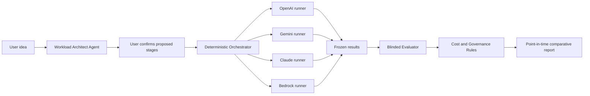

Yes—design-ready, but not yet safe to turn on unrestricted provider calls.

The current estimator can become the deterministic control plane. The models and agents should operate inside its limits, not replace its rules.

## Implementation status — controlled increment 1

- Built the public `/compare` catalog-only experience.
- Locked the preview policy at three models, three synthetic cases, one repeat, one retry, two concurrent calls, and a $1 maximum.
- Added deterministic frozen-request and provider-envelope contracts.
- Added no-network OpenAI, Google, and Anthropic runner rehearsals.
- Kept live execution disabled until authentication, credentials, predicted maximum cost, explicit approval, and an actual-charge ledger exist.

## The right architecture

The important distinction:

- Provider runners are controlled adapters, not autonomous agents.
- The orchestrator enforces budgets, limits, and stopping conditions.
- Agents can propose a workflow and evaluate results.
- Deterministic rules calculate costs and control eligibility.
- No model gets to price itself, grade itself, or approve itself.

## Locked agent roster

| Component | Responsibility | Hard boundary |
|---|---|---|
| Workload Architect Agent | Converts an idea into proposed stages such as OCR, speech, retrieval, and response | Suggestions require user confirmation |
| Test Designer Agent | Creates synthetic representative cases | Cannot call providers or choose a winner |
| Evaluation Orchestrator | Freezes the suite and dispatches provider runs | Fixed budget, concurrency, repeats, and timeout |
| Provider Runners | Translate one frozen case into each provider’s API format | Cannot change prompts or scoring |
| Blinded Evaluator | Scores anonymous outputs against the same rubric | Cannot see provider or price |
| Cost Specialist | Uses reported tokens, tools, retries, and prices to calculate actual cost | Cannot invent missing fees |
| Governance Controller | Applies privacy, evidence, budget, and eligibility rules | Cannot waive a blocking rule |
| Report Presenter | Produces the comparative point-in-time report | Cannot introduce new claims |

Each contract should lock:

- Input and output schema
- Allowed tools and data
- Maximum calls, retries, time, and spending
- Version and prompt hash
- Stop conditions
- Prohibited actions
- Required tests
- Evidence handed to the next stage

That gives us a genuine multi-agent workflow while retaining a deterministic decision boundary.

## Comparative Model Analysis page

This should have two modes.

### Catalog comparison — free and public

Shows:

- Published price components
- Modalities
- Context windows
- Tools
- Regions and availability
- Evidence date and source
- Missing-cost warnings
- Evaluation status

Google and Anthropic both expose model-list APIs, although pricing still needs a separate reviewed ingestion process. Google’s Models API returns availability, supported functions, and token limits; Anthropic also provides a model-list endpoint. [Gemini Models API](https://ai.google.dev/api/models), [Claude Models API](https://platform.claude.com/docs/en/api/beta/models/list)

### Live comparison — explicit, authenticated, and paid

Runs the same frozen cases and reports:

- Completed-task success
- p10/p50/p90 output tokens
- Retry and checker rates
- p50/p95 latency
- Input, output, cached, reasoning, and tool usage
- Actual API charge
- Cost per successful completed task
- Sample size and confidence
- Evidence date
- Failure and refusal rates

Provider responses expose actual usage information. Anthropic, for example, separates input, output, cache creation, cache reads, thinking, and server-tool activity. [Claude Messages usage](https://platform.claude.com/docs/en/api/go/messages)

OpenAI provides evaluation resources for defining criteria and rerunning the same evaluation across model configurations. Its Responses API also supports agentic tool-calling, although multi-agent operation is currently described as beta and should not become our governance foundation. [OpenAI Evals API](https://developers.openai.com/api/reference/resources/evals), [OpenAI model and agent guidance](https://developers.openai.com/api/docs/guides/latest-model)

## How far should it run?

Use explicit operating levels:

| Level | Behavior | Suggested cap |
|---|---|---:|
| 0 — Catalog | No models run | $0 |
| 1 — Preview | 3 models × 3 synthetic cases × 1 run | $1 |
| 2 — Comparison | 3–6 models × 5–10 cases × 2–3 repeats | $5–$10 |
| 3 — Evidence run | Larger repeated suite with confidence reporting | User-approved |
| 4 — Production monitoring | Recurring evaluation and actual-cost reconciliation | Admin-only |

Every live run should require:

- A predicted maximum cost
- User confirmation
- Maximum provider count
- Maximum cases and repeats
- Maximum concurrent calls
- Per-provider timeout
- At most one retry unless explicitly raised
- A hard-dollar circuit breaker
- Automatic stop if actual spend reaches the cap
- No raw private idea storage by default

Google explicitly notes that agent loops incur input, output, intermediate reasoning, and tool charges. That supports our decision to meter every individual call rather than price only the final response. [Gemini agent pricing](https://ai.google.dev/gemini-api/docs/pricing)

## Does RAG make sense?

Yes—but not for performing the cost math.

RAG is valuable for retrieving:

- Official provider documentation
- Historical pricing snapshots
- Model lifecycle and deprecation notices
- Capability evidence
- Governance policies
- Evaluation rubrics
- Prior approved reports

RAG should answer:

> “What source supports this capability or pricing field?”

It should not answer:

> “What does this model cost?”

Prices must come from structured, dated, versioned records. Otherwise retrieval could return an old paragraph and silently contaminate the calculation.

The corpus is initially small, so we should begin with structured records and full-text retrieval—not immediately build an elaborate vector database. Add embeddings when the documentation, eval cases, and reports become too large for deterministic filtering.

## AWS is now useful—but not because RAG requires it

A sensible AWS foundation would be:

- S3: immutable provider snapshots, evaluation datasets, JSONL results, and reports
- DynamoDB: projects, run status, budgets, model metadata, scores, and decision records
- Step Functions: bounded orchestration and stopping logic
- Lambda: provider adapters and calculation workers
- SQS: controlled provider-run queue
- Secrets Manager: OpenAI, Google, and Anthropic keys
- EventBridge: scheduled catalog checks
- CloudWatch: latency, errors, and spend telemetry
- Cognito/API Gateway: authenticated live evaluation access
- KMS: encryption
- AWS Budgets: account-level backstop

AWS Bedrock already supports programmatic model and RAG evaluations, custom datasets, LLM-as-judge and human evaluation. Its evaluation outputs are stored as JSONL in S3, which aligns well with this architecture. [Bedrock evaluations](https://docs.aws.amazon.com/bedrock/latest/userguide/evaluation.html), [Bedrock S3 evaluation results](https://docs.aws.amazon.com/bedrock/latest/userguide/model-evaluation-report-s3.html)

Provider credentials belong in Secrets Manager and should only be accessible to the relevant execution worker. [AWS Secrets Manager with Lambda](https://docs.aws.amazon.com/lambda/latest/dg/with-secrets-manager.html)

## Privacy model

Default behavior should be:

- The public estimator does not save the idea.
- Catalog comparison makes no provider calls.
- Live evaluation requires sign-in and confirmation.
- Synthetic cases are the default.
- Raw prompts and outputs are not retained unless the user opts in.
- Metadata and aggregated usage may be retained without prompt content.
- Every stored project has Download, Delete, and Clear now.
- Retention has an explicit expiration date.
- Reports disclose exactly what was stored and sent to whom.

## Recommended next controlled increment

Do not provision the AWS environment first. Lock the product contract first:

1. Add the Comparative Model Analysis page in catalog-only mode.
2. Codify the agent contracts and live-run budget policy.
3. Define the AWS schemas and privacy/retention controls.
4. Build mocked OpenAI, Gemini, and Claude adapters.
5. Run the inventory workload through all adapters without spending money.
6. Connect one provider at a time.
7. Run a capped `$1` synthetic comparison.
8. Verify actual usage and charge reconciliation.
9. Only then enable the live-comparison button.

That is the point where AI Build Crew becomes more than a static estimator: a governed, provider-neutral evidence platform.
